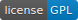
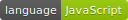

## 使用方法

- 推荐从豆瓣电影官网访问，二级域名`douban`后加`s`即可跳转 [https://movie.douban`s`.com/subject/1889243](https://movie.doubans.com/subject/1889243)

- 调用本项目后端API服务你的前端应用 [API文档 (html)](https://movie.doubans.com/api) ，[API文档 (md)](https://github.com/humingk/douban_movie_plus/blob/master/doc/api/AllInOne.md) ，[Postman测试 (json)](https://github.com/humingk/douban_movie_plus/blob/master/doc/api/postman.json)

- 聊天吹水提建议，欢迎加入QQ豆瓣电影Plus交流群 `476584154` ，口令：`doubans`

## 开发流程

### 后端开发 (Spring)

[后端仓库](https://github.com/humingk/douban_movie_plus)

### 前端开发 (Vue)

#### 0. fork

#### 1. clone (替换用户名)

`git clone -b dev --depth 1 https://github.com/humingk/douban_movie_vue`

or

`git clone -b dev --depth 1 git@github.com:humingk/douban_movie_vue.git`

#### 2. npm安装

- npm 6.13.4

`npm install`

#### 3. 启动

`npm run serve`

#### 4. 请提交到**dev**分支

## 声明

- 本项目仅供学习交流，如有侵权请联系本人,将立即删除

- 免费提供doubans三级域名book,music等解析

- 本项目有很多很多需要改进的地方！欢迎大家一起完善这个项目